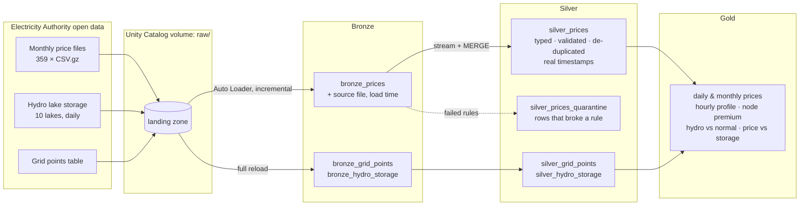

# NZ Electricity Lakehouse

**When New Zealand's hydro lakes run low, wholesale power costs three times as much.**

A Databricks lakehouse for 30 years of New Zealand wholesale electricity prices: **128 million half-hourly prices** at 317 grid points (October 1996 to August 2026), joined to daily storage in the country's ten main hydro lakes. Built with PySpark and Delta Lake in a bronze → silver → gold design, with incremental loading, data-quality rules, unit tests and a job deployed from this repo as code.

## Architecture



A **file-arrival trigger** starts the job when a new monthly file lands in the volume. Auto Loader reads only files it hasn't seen, silver processes only new bronze rows and `MERGE`s them in, so re-running is always safe and a revised file replaces the old prices.

## Findings

| | |
|---|---|
| **Low lakes, high prices** | Months when national hydro storage is below 70% of normal average **$152/MWh** at Otahuhu (Auckland), against **$48** when lakes are above 115% of normal. Correlation −0.46 (−0.62 on log prices at Benmore), 339 months. |
| **A new price level since 2018** | Annual averages were mostly $40–80/MWh from 1996 to 2017, and $110–200 from 2018. 2024 was the record: $200 on average, $452 in August, and 800 half-hours above $500. Prices are nominal. |
| **Dry years flip the islands** | Auckland usually pays about $10/MWh more than Benmore in the South Island. In dry years the South Island's hydro is scarce and it flips: in 2008 (storage 75% of normal) Benmore was $19 dearer. The spread tracks storage (r = 0.52). |
| **The 6pm peak** | The evening peak is the dearest half-hour in every season; summer overnight prices averaged $6/MWh over the past year. |
| **Location** | Over the past year Northland and north Auckland nodes averaged about $3/MWh above Otahuhu, and the Clutha and Manapōuri generation nodes about $11 below: the cost of transmission losses. |

## Data quality

The silver layer checks every row against named rules (`src/nzelec/transforms.py`). Rows that fail are kept, with the rules they broke, in `silver_prices_quarantine`.

| Rule | What it catches | Rows |
|---|---|---|
| `not_placeholder` | ±$100,000/MWh, which fills whole days, sometimes weeks, at 103 nodes between 1998 and 2006: a placeholder, not a price | 123,745 |
| `price_plausible` | anything outside −$10,000 to $50,000 | 0 |
| `date_present`, `period_in_range`, `poc_format`, `price_present` | malformed rows | 0 |

Other checks, run after every load:

- **Trading periods:** every day at Otahuhu has 48 half-hours, or 46 or 50 when daylight saving starts or ends. Periods are converted to real timestamps from local midnight in UTC, so the skipped and repeated hours land correctly (unit-tested). The market's first week (1–7 October 1996) is incomplete in the source and is excluded from the check.
- **Strict types:** casts are `try_cast`, so a malformed value is quarantined instead of failing the job (Databricks serverless runs in ANSI mode).
- **Lineage:** every bronze row keeps the file it came from and when it was loaded.
- **Duplicates:** one row per date, period and node; a re-delivered file updates prices instead of duplicating them.

## Tables

| Layer | Table | Rows |
|---|---|---|
| Bronze | `bronze_prices` | 128.0 M |
| Silver | `silver_prices` | 127.9 M |
| Silver | `silver_prices_quarantine` | 123,745 |
| Silver | `silver_grid_points`, `silver_hydro_storage` | reference |
| Gold | `gold_daily_reference_prices`, `gold_monthly_prices`, `gold_hourly_profile`, `gold_hydro_national`, `gold_price_vs_storage`, `gold_node_premium` | small |

## Repository

```
├── databricks.yml               # Asset Bundle: deploys the job from this repo
├── resources/pipeline.job.yml   # bronze -> silver -> gold job, file-arrival trigger
├── src/
│   ├── nzelec/                  # tested Python package
│   │   ├── config.py            # catalog, schema, volume paths
│   │   ├── io.py                # Auto Loader ingestion, reference files
│   │   ├── transforms.py        # pure DataFrame transformations and quality rules
│   │   └── pipeline.py          # the steps, shared by notebooks and local runs
│   └── notebooks/               # thin Databricks notebooks that call the package
├── tests/                       # pytest + local Spark: DST, quality rules, de-duplication
├── tools/
│   ├── download_data.py         # fetch the source files from the Electricity Authority
│   └── run_local.py             # run the whole pipeline with open-source Spark + Delta
└── .github/workflows/ci.yml     # unit tests on every push
```

## Run it

**On Databricks (Free Edition works):**

1. `python tools/download_data.py` on your machine, then upload `prices/`, `hydro/` and `reference/` into the volume `workspace.nz_electricity.raw` (the notebook `00_setup` creates it).
2. Add this repo as a Git folder, then deploy the bundle (or run `01_bronze`, `02_silver` and `03_gold` in order).
3. To add a month, upload its file to `raw/prices/`; the job runs by itself.

**Locally:**

```bash
pip install -r requirements-dev.txt     # needs Java 17+
pytest -q tests
python tools/run_local.py ~/Downloads/nz-electricity-data   # about 8 minutes on a laptop
```

## Data

[Electricity Authority Electricity Market Information (EMI)](https://www.emi.ea.govt.nz/): final energy prices, the Hydrological Modelling Dataset (storage series to December 2024) and the network supply points table. Prices are in NZD per MWh, nominal.

## Built with

Databricks · PySpark · Delta Lake · Auto Loader · Unity Catalog · Databricks Asset Bundles · pytest · GitHub Actions
